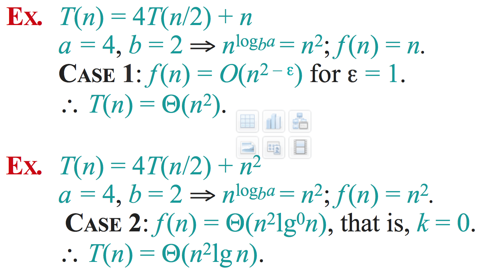
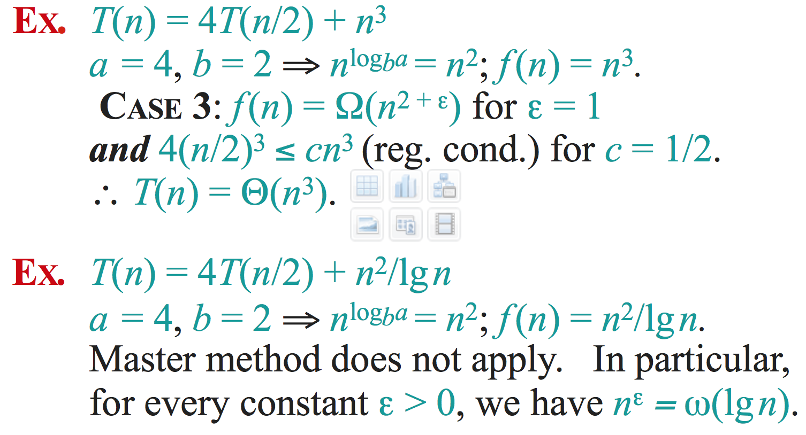

SOLID:
- Single responsibility principle
- Open close principle: open to extension, close to modification
- Liskov substitution principle: subclass can replace parent class
- Interface segregation principle
- Dependency inversion principle

5C template
- Clarify
  * what: use keywords to ask questions
  * how
  * who
- Core object
- Cases
- Classes
- Correctness

[OOD UML access modifier](http://javajee.com/important-uml-diagrams-required-to-work-with-design-patterns)
- \~ default
- \+ public
- \- private
- \# protected

## Master theorem



## jiuzhang advanced algorithm
### Chapter 1
- moving window with two pointer
  * The core of these questions are
    + `how to check the valid state efficiently`
    + maintain a consistent state
      - if the state is not valid at the beginning `find a valid state in while loop`
      - if the state is valid at the beginning `keep a valid state through out the for & while loop`
        ```java
        int ans = Integer.MAX_VALUE;
        for (int lo = 0, hi = 0, sum = 0; lo < nums.length; lo++){
            while (sum < s && hi < nums.length){
                sum += nums[hi++];
            }
            if (sum >= s){
                ans = Math.min(ans, hi - lo);
            }
            sum -= nums[lo];
        }
        return ans == Integer.MAX_VALUE ? -1 : ans;
        ```
  * [406. Minimum Size Subarray Sum](http://www.lintcode.com/en/problem/minimum-size-subarray-sum/)
    + valid condition: `sum >= s`
  * `*` [32. Minimum Window Substring](http://www.lintcode.com/en/problem/minimum-window-substring/)
    + valid condition `validLen >= target.length()`
  * [384. Longest Substring Without Repeating Characters](http://www.lintcode.com/en/problem/longest-substring-without-repeating-characters/)
    + valid condition `map[cur] == false`
  * [386. Longest Substring with At Most K Distinct Characters](http://www.lintcode.com/en/problem/longest-substring-with-at-most-k-distinct-characters/)
    + `always keep hi pointing to a valid state in the while loop`
- Kth Smallest Number in Arrays / Matrix
  * `***`[401. Kth Smallest Number in Sorted Matrix](http://www.lintcode.com/en/problem/kth-smallest-number-in-sorted-matrix/)
    + hard: `divide & conquer`
    + tricky part: `return left;`
  * [543. Kth Largest in N Arrays](http://www.lintcode.com/en/problem/kth-largest-in-n-arrays/)
    + think about when k > average array length
    + naive pq method: `n * m * log(k)`
    + improve method: `n * m * log(m) + k * log(k)`
  * `***`[465. Kth Smallest Sum In Two Sorted Arrays](http://www.lintcode.com/en/problem/kth-smallest-sum-in-two-sorted-arrays/)
    + `visualize two arrays as a sorted matrix`


### Chapter 2 data structure part 1
- Union Find
  * [589. Connecting Graph](http://www.lintcode.com/en/problem/connecting-graph/)
  * `*`[590. Connecting Graph II](http://www.lintcode.com/en/problem/connecting-graph-ii/)
  * [591. Connecting Graph III](http://www.lintcode.com/en/problem/connecting-graph-iii/)
  * `**`[433. Number of Islands](http://www.lintcode.com/en/problem/number-of-islands/)
    + only have to look up the left and up
  * `***`[434. Number of Islands II](http://www.lintcode.com/en/problem/number-of-islands-ii/)
    + always remember `i * m + j`
    + how to handle sparse matrix when both n and m are extremely large: use hashmap instead of int array
  * [178. Graph Valid Tree](http://www.lintcode.com/en/problem/graph-valid-tree/)
  * `**`[477. Surrounded Regions](http://www.lintcode.com/en/problem/surrounded-regions/)
- Trie
  * [442. Implement Trie](http://www.lintcode.com/en/problem/implement-trie/)
  * `*`[473. Add and Search Word](http://www.lintcode.com/en/problem/add-and-search-word/)
  * `**`[132. Word Search II](http://www.lintcode.com/en/problem/word-search-ii/)
  * `***`[634. Word Squares](http://www.lintcode.com/en/problem/word-squares/)
    ```java
    class TrieNode{
        List<String> startWith;
        boolean hasWord;
    }
    ```

### Chapter 3 data structure part 2
- Heap
  * `***`[363. Trapping Rain Water](http://lintcode.com/en/problem/trapping-rain-water/)
    + mem O(n) using stack
    + mem O(1) using two pointers
  * `***`[364. Trapping Rain Water II](http://lintcode.com/en/problem/trapping-rain-water-ii/)
  * `**`[81. Data Stream Median](http://lintcode.com/en/problem/data-stream-median/)
  * `***`[360. Sliding Window Median](http://lintcode.com/en/problem/sliding-window-median/)
    + TreeSet.remove(obj) is O(n)
    + TreeSet.last() is O(1)
    + TreeSet.first() is O(1)
    + **Compare treeset element by both value and index**
- Stack
  * [12. Min Stack](http://www.lintcode.com/en/problem/min-stack/)
  * [40. Implement Queue by Two Stacks](http://www.lintcode.com/en/problem/implement-queue-by-two-stacks/)
  * **TODO**[126. Max Tree](http://www.lintcode.com/en/problem/max-tree/)
  * `*`[575. Expression Expand](http://www.lintcode.com/en/problem/expression-expand/)
  * `***`[122. Largest Rectangle in Histogram](http://www.lintcode.com/en/problem/largest-rectangle-in-histogram/)
    ```java
    Deque<Integer> deque = new ArrayDeque<>();
    for (int i = 0; i <= height.length; i++){
        int curVal = i == height.length? 0 : height[i];
        while (!deque.isEmpty() && curVal <= height[deque.peek()]){
            int h = height[deque.pop()];
            int w = deque.isEmpty() ? i : i - deque.peek() - 1;
            ans = Math.max(ans, h * w);
        }
        deque.push(i);
    }
    return ans;
    ```

### Chapter 4 binary search, linear scan
- binary search
  * `*`[75. Find Peak Element](http://www.lintcode.com/en/problem/find-peak-element/)
    ```java
    while (lo + 1 < hi){
      lo = mid
    }
    while (lo <= hi){
      lo = mid + 1
    }
    ```
  * `***`[390. Find Peak Element II](http://www.lintcode.com/en/problem/find-peak-element-ii/)
  * `*` [586. Sqrt(x) II](http://www.lintcode.com/en/problem/sqrtx-ii/)
    + `double eps = 1e-12;`
  * `*`[183. Wood Cut](http://www.lintcode.com/en/problem/wood-cut/)
    + `boolean check(...)`
  * `***`[633. Find the Duplicate Number](http://www.lintcode.com/en/problem/find-the-duplicate-number/)
    + O(nlogn)
  * `**`[437. Copy Books](http://www.lintcode.com/en/problem/copy-books/)
  * `***`[617. Maximum Average Subarray](http://www.lintcode.com/en/problem/maximum-average-subarray/)
    ```java
    boolean valid(int[] nums, int k, double mid){
        int n = nums.length;
        double[] sum = new double[n + 1];
        double pre_min = 0;
        for (int i = 0; i < n; i++){
            sum[i + 1] = sum[i] + (nums[i] - mid);
            if (i >= k - 1){
                pre_min = Math.min(pre_min, sum[i + 1 - k]);
                if (sum[i + 1] - pre_min >= 0){
                    return true;
                }
            }
        }
        return false;
    }
    ```
- Sweep-Line
  * `*`[391. Number of Airplanes in the Sky](http://www.lintcode.com/en/problem/number-of-airplanes-in-the-sky/)
  * **TODO**`***`[131. Building Outline](http://www.lintcode.com/en/problem/building-outline/)
- Deque
  * `***`[362. Sliding Window Maximum](http://www.lintcode.com/en/problem/sliding-window-maximum/)

### Chapter 5 DP part 1
- rolling arrays
  * `*`[534. House Robber II](http://www.lintcode.com/en/problem/house-robber-ii/)
  * `*`[436. Maximal Square](http://www.lintcode.com/en/problem/maximal-square/)
  * [114. Unique Paths](http://www.lintcode.com/en/problem/unique-paths/)
  * **TODO**[110. Minimum Path Sum](http://www.lintcode.com/en/problem/minimum-path-sum/)
  * **TODO**[119. Edit Distance](http://www.lintcode.com/en/problem/edit-distance/)
- memorized search
  * [397. Longest Increasing Continuous Subsequence](http://www.lintcode.com/en/problem/longest-increasing-continuous-subsequence/)
  * [398. Longest Increasing Continuous subsequence II](http://www.lintcode.com/en/problem/longest-increasing-continuous-subsequence-ii/)
  * `**`[200. Longest Palindromic Substring](http://www.lintcode.com/en/problem/longest-palindromic-substring/)
  * `**`[191. Maximum Product Subarray](http://www.lintcode.com/en/problem/maximum-product-subarray/)

#### 144. Interleaving Positive and Negative Numbers


#### 390. [Find Peak Element II](http://www.lintcode.com/en/problem/find-peak-element-ii/)
[MIT lecture](http://courses.csail.mit.edu/6.006/spring11/lectures/lec02.pdf)
- find the peak value in A[x...][mid] and A[mid][y...]
- search near the peak value

#### 404. [Subarray Sum II](http://www.lintcode.com/en/problem/subarray-sum-ii/)
- **九章的答案松松垮垮，下标满天飞，感觉有错，而且也完全记不住**
- binary search
  ```java
  int find(int[] A, int len, int value) {
      if (A[len-1] < value )
          return len;

      int l = 0, r = len-1, ans = 0;
      while (l <= r) {
          int mid = (l + r) / 2;
          if (value <= A[mid]) {
              ans = mid;
              r = mid - 1;
          }  else
              l = mid + 1;
      }
      return ans;
  }
  ```

## jiuzhang dp
### Chapter 1
- what dp ask for?
  * count
  * min/max
  * true/false(exist or not)
    + OR
- four key component for dp
  * state definition
    + the last step
    + convert to subproblem
  * transition function
  * initial state and bound
  * correct computation sequence
- exercise
  * [669. Coin Change](http://www.lintcode.com/en/problem/coin-change/)
  * `*` [114. Unique Paths](http://www.lintcode.com/en/problem/unique-paths/)
  * [116. Jump Game](http://www.lintcode.com/en/problem/jump-game/)
  * `***` [191. Maximum Product Subarray](http://www.lintcode.com/en/problem/maximum-product-subarray/)

### Chapter 2
- exercise
  * [115. Unique Paths II](http://www.lintcode.com/en/problem/unique-paths-ii/)
  * [515. Paint House](http://www.lintcode.com/en/problem/paint-house/)
  * `**` [512. Decode Ways](http://www.lintcode.com/en/problem/decode-ways/)
    + reject invalid string first
  * `**` [553. Bomb Enemy](http://www.lintcode.com/en/problem/bomb-enemy/)
  * `**` [664. Counting Bits](http://www.lintcode.com/en/problem/counting-bits/)

### Chapter 3
- 有状态的序列型动态规划(不知道的信息加入状态)
  * `*` [516. Paint House II](http://www.lintcode.com/en/problem/paint-house-ii/)
    + O(nk)
  * [392. House Robber](http://www.lintcode.com/en/problem/house-robber/)
  * [534. House Robber II](http://www.lintcode.com/en/problem/house-robber-ii/)
  * [149. Best Time to Buy and Sell Stock](http://www.lintcode.com/en/problem/best-time-to-buy-and-sell-stock/)
  * [150. Best Time to Buy and Sell Stock II](http://www.lintcode.com/en/problem/best-time-to-buy-and-sell-stock-ii/)
  * `***` [151. Best Time to Buy and Sell Stock III](http://www.lintcode.com/en/problem/best-time-to-buy-and-sell-stock-iii/)
    + f[i][j] -> 前i天结束后，在阶段j的最大获利
    + 无需记录何时购入股票，每次都用当日价格跟前日价格进行比较，每日可能的利润都卷入计算过程
  * `***` [393. Best Time to Buy and Sell Stock IV](http://www.lintcode.com/en/problem/best-time-to-buy-and-sell-stock-iv/)
  * `***` [76. Longest Increasing Subsequence](http://www.lintcode.com/en/problem/longest-increasing-subsequence/)
    + O(nlogn) Binary Search
  * `**` [602. Russian Doll Envelopes](http://www.lintcode.com/en/problem/russian-doll-envelopes/)

### Chapter 4
- 划分型动态规划
  * `*` [513. Perfect Squares](http://www.lintcode.com/en/problem/perfect-squares/)
  * `***` [108. Palindrome Partitioning II](http://www.lintcode.com/en/problem/palindrome-partitioning-ii/)
  * `***` [437. Copy Books](http://www.lintcode.com/en/problem/copy-books/)
    + pure dp
    + Binary Search
- 博弈动态规划
  * [394. Coins in a Line](http://lintcode.com/en/problem/coins-in-a-line/)
- 背包型动态规划
  * [92. Backpack](http://lintcode.com/en/problem/backpack/)
  * [563. Backpack V](http://lintcode.com/en/problem/backpack-v/)
  * `*` [564. Backpack VI](http://lintcode.com/en/problem/backpack-vi/)
  * `*` [125. Backpack II](http://www.lintcode.com/en/problem/backpack-ii/)
  * `*` [440. Backpack III](http://www.lintcode.com/en/problem/backpack-iii/)

### Chapter 5
- 区间型动态规划(适合记忆化搜索来解题)
  * 关键字：去头去尾，消去
  * `**` [667. Longest Palindromic Subsequence](http://www.lintcode.com/en/problem/longest-palindromic-subsequence/)
    + 思考如何打印路径
    + 如何利用记忆化搜索来解题
  * `**` [396. Coins in a Line III](http://www.lintcode.com/en/problem/coins-in-a-line-iii/)
    + 利用差额求解 `f[i][j] = max(A[i]-f[i+1][j],A[j]-f[i][j-1])`
    + If n is even. Is there any hacky algorithm that can decide whether first player will win or lose in O(1) memory and O(n) time?
  * `***` [430. Scramble String](http://www.lintcode.com/en/problem/scramble-string/)
    + f[i][j][len]
  * `***` [168. Burst Balloons](http://www.lintcode.com/en/problem/burst-balloons/)
    + 消去题 -> 倒着想
  * 矩阵相乘 matrix multiplication DP

### Chapter 6
- 双序列型动态规划
  * [77. Longest Common Subsequence](http://www.lintcode.com/en/problem/longest-common-subsequence/)
  * [29. Interleaving String](http://www.lintcode.com/en/problem/interleaving-string/)
  * [119. Edit Distance](http://www.lintcode.com/en/problem/edit-distance/)
  * `**` [118. Distinct Subsequences](http://www.lintcode.com/en/problem/distinct-subsequences/)
    + don't write `f[i - 1]` as `f[i - i]`
  * `**` [154. Regular Expression Matching](http://www.lintcode.com/en/problem/regular-expression-matching/)
  * `*` [192. Wildcard Matching](http://www.lintcode.com/en/problem/wildcard-matching/)
  * `***` [668. Ones and Zeroes](http://www.lintcode.com/en/problem/ones-and-zeroes/)
    + 双背包

### Chapter 7
- hard
  * `**` [752. Rogue Knight Sven](http://lintcode.com/en/problem/rogue-knight-sven/)
    + pre sum 优化复杂度为O(mn)
  * `**` [89. k Sum](http://www.lintcode.com/en/problem/k-sum/)
  * `***` [76. Longest Increasing Subsequence](http://www.lintcode.com/en/problem/longest-increasing-subsequence/)
    + binary search O(n*log(n))
    + dp O(n^2)
  * `***` [623. K Edit Distance](http://www.lintcode.com/en/problem/k-edit-distance/)
  * `**` [622. Frog Jump](http://www.lintcode.com/en/problem/frog-jump/)
    + 注意优化，不要look back
  * `**` [676. Decode Ways II](http://www.lintcode.com/en/problem/decode-ways-ii/)

## By category
### [math](https://leetcode.com/tag/math/)
  * `*`[418. Integer to Roman](http://www.lintcode.com/en/problem/integer-to-roman/)
### matrix
  * `*`[161. Rotate Image](http://www.lintcode.com/en/problem/rotate-image/)
  * `**`[654. Sparse Matrix Multiplication](http://www.lintcode.com/en/problem/sparse-matrix-multiplication/)
    ```java
    for (int i = 0; i < n; i++) {
        for (int k = 0; k < t; k++) {
            if (A[i][k] == 0) {
                continue;
            }
            for (int p = 0; p < col.get(k).size(); p++) {
                int j = col.get(k).get(p);
                C[i][j] += A[i][k] * B[k][j];
            }
        }
    }
    ```
### linkedlist
  * `**`[141. Linked List Cycle](https://leetcode.com/problems/linked-list-cycle/description/)
    + remove head.next from the linkedlist: `head.next = head.next.next;`
  * [116. Populating Next Right Pointers in Each Node](https://leetcode.com/problems/populating-next-right-pointers-in-each-node/description/)
### **O(1) space**
### BFS
  * `**`[127. Word Ladder](https://leetcode.com/problems/word-ladder/description/)
    + [Two-end BFS](https://leetcode.com/problems/word-ladder/discuss/40711/Two-end-BFS-in-Java-31ms)
### q select
  * `***`[5. Kth Largest Element](http://www.lintcode.com/en/problem/kth-largest-element/)
    + `ThreadLocalRandom.current().nextInt(lo, hi + 1)`
    + There are two scenarios after the scan & swap
      - (hi) (lo)
        * hi and lo may be out of bound, so the value of num[hi], num[lo] is not useful at all
        * if hi and lo is in bound, num[hi]<=pivot, num[lo]>=pivot
      - (hi) (pivot) (lo)
        * if the index of pivot is k - 1, return pivot
### Sorting
  * **TODO**
### [Backtracking](http://www.lintcode.com/en/tag/backtracking/)
  * [135. Combination Sum](http://www.lintcode.com/en/problem/combination-sum/)
    + remove dup first
  * `***`[634. Word Squares](http://www.lintcode.com/en/problem/word-squares/)
### [Segment Tree](http://www.lintcode.com/en/tag/segment-tree/)
  * `*`[439. Segment Tree Build II](http://lintcode.com/en/problem/segment-tree-build-ii/)
  * `*`[247. Segment Tree Query II](http://lintcode.com/en/problem/segment-tree-query-ii/)
  * `*`[203. Segment Tree Modify](http://www.lintcode.com/en/problem/segment-tree-modify/)
  * `**` [207. Interval Sum II](http://www.lintcode.com/en/problem/interval-sum-ii/)
  * `***`[249. Count of Smaller Number before itself](http://www.lintcode.com/en/problem/count-of-smaller-number-before-itself/)
  * `**`[307. Range Sum Query - Mutable](https://leetcode.com/problems/range-sum-query-mutable/description/)
  * `**`[751. John's business](http://lintcode.com/en/problem/johns-business/)
### [Binary Indexed Trees | FenwickTree](https://www.topcoder.com/community/data-science/data-science-tutorials/binary-indexed-trees/)
  * `**`[307. Range Sum Query - Mutable](https://leetcode.com/problems/range-sum-query-mutable/description/)
    + https://www.youtube.com/watch?v=WbafSgetDDk
  * `***`[308. Range Sum Query 2D - Mutable](https://leetcode.com/problems/range-sum-query-2d-mutable/description/)
  * `***`[315. Count of Smaller Numbers After Self](https://leetcode.com/problems/count-of-smaller-numbers-after-self/description/)
    + https://www.youtube.com/watch?v=2SVLYsq5W8M
### DP
  * `**`[139. Word Break](https://leetcode.com/problems/word-break/description/)
  * `***`[494. Target Sum](https://leetcode.com/problems/target-sum/description/)
  * `**`[5. Longest Palindromic Substring](https://leetcode.com/problems/longest-palindromic-substring/description/)
    + [solution](https://leetcode.com/problems/longest-palindromic-substring/discuss/2921/Share-my-Java-solution-using-dynamic-programming)
### Manacher’s Algorithm
  * `***`[5. Longest Palindromic Substring](https://leetcode.com/problems/longest-palindromic-substring/description/)
### [Topological Sort](https://leetcode.com/tag/topological-sort/)
### radix sort
### Skip List
  * Redis sorted set is using skip list
  * [Skip List Insertion](https://www.youtube.com/watch?v=Dx7Hk8-8Kdw)
### 点在多边形内
### [Determine if two rectangles overlap each other?](https://stackoverflow.com/questions/306316/determine-if-two-rectangles-overlap-each-other)
```cpp
if (RectA.Left < RectB.Right && RectA.Right > RectB.Left &&
     RectA.Top > RectB.Bottom && RectA.Bottom < RectB.Top )
```

## 跟花花酱练习CPP
- unordered_map
  * [if the value doesn't exist in the map, operator[] will default-construct and insert one](https://stackoverflow.com/questions/6897737/using-the-operator-efficiently-with-c-unordered-map)
    ```cpp
    iterator iter = map.find(key);
    if(iter == map.end()){
        iter = map.insert(value_type(key, int())).second;
    }
    return iter;
    ```
  * [LeetCode 560. Subarray Sum Equals K](https://leetcode.com/problems/subarray-sum-equals-k/description/)

## 竞赛中出现的常见错误
- 多层循环中continue和break用错
- 直接使用了Trie的root
-

## leetcode contest
- [Weekly Contest 68](https://leetcode.com/contest/weekly-contest-68/)
  * [766. Toeplitz Matrix](https://leetcode.com/contest/weekly-contest-68/problems/toeplitz-matrix/)
    ```java
    public boolean isToeplitzMatrix(int[][] matrix) {
        for (int i = 0; i < matrix.length - 1; i++) {
            for (int j = 0; j < matrix[i].length - 1; j++) {
                if (matrix[i][j] != matrix[i + 1][j + 1]) return false;
            }
        }
        return true;
    }
    ```
  * [767. Reorganize String](https://leetcode.com/contest/weekly-contest-68/problems/reorganize-string/)
  * [769. Max Chunks To Make Sorted (ver. 1)](https://leetcode.com/contest/weekly-contest-68/problems/max-chunks-to-make-sorted-ver-1/)
  * [768. Max Chunks to Make Sorted (ver. 2)](https://leetcode.com/contest/weekly-contest-68/problems/max-chunks-to-make-sorted-ver-2/)
    + Same solution for two problem: [Java solution, left max and right min.](https://discuss.leetcode.com/topic/117872/java-solution-left-max-and-right-min)
  * [770. Basic Calculator IV](https://leetcode.com/contest/weekly-contest-68/problems/basic-calculator-iv/)

- [Weekly Contest 69](https://leetcode.com/contest/weekly-contest-69)
  * `***`[773. Sliding Puzzle](https://leetcode.com/contest/weekly-contest-69/problems/sliding-puzzle/)
    + [construct the next permutation in lexicographic order](https://www.quora.com/How-would-you-explain-an-algorithm-that-generates-permutations-using-lexicographic-ordering)
      - Find the largest x such that P[x]<P[x+1].
        * (If there is no such x, P is the last permutation.)
      - Find the largest y such that P[x]<P[y].
      - Swap P[x] and P[y].
      - Reverse P[x+1 .. n].
      - [video demo](https://www.youtube.com/watch?v=goUlyp4rwiU)
    + `Permutation Encoding` copied from uwi
      ```java
      public int encPerm(int[] a){
          int n = a.length;
          int used = 0;
          int ret = 0;
          for(int i = 0;i < n;i++){
              ret = ret * (n - i) + a[i] - Integer.bitCount(used & ((1<<a[i]) - 1));
              used |= 1<<a[i];
          }
          return ret;
      }
      ```
    + `***`[My submission](https://leetcode.com/submissions/detail/138297283/): Runtime: 10 ms
    + [simple BFS implementation](https://discuss.leetcode.com/topic/118770/java-19ms-28-clean-lines-bfs-with-comment)
      ```java
      for (int sz = q.size(); sz > 0; --sz) {
      }
      ```
  * `**`[774. Minimize Max Distance to Gas Station](https://leetcode.com/contest/weekly-contest-69/problems/minimize-max-distance-to-gas-station/)
    + When you see the question accept an approximate result as the answer, you know it's `divide and conquer`
    ```java
    while (lo + 1e-6 < hi){}
    ```
- [Weekly Contest 70](https://leetcode.com/contest/weekly-contest-70/)
  * [779. K-th Symbol in Grammar](https://leetcode.com/contest/weekly-contest-70/problems/k-th-symbol-in-grammar/)
      - from uwi
      ```java
      class Solution {
    	    public int kthGrammar(int N, int K) {
    	        return Integer.bitCount(K-1)%2;
    	    }
    	}
      ```
- [Weekly Contest 71](https://leetcode.com/contest/weekly-contest-71)
  * [783. Minimum Distance Between BST Nodes](https://leetcode.com/contest/weekly-contest-71/problems/minimum-distance-between-bst-nodes/)
  * [781. Rabbits in Forest](https://leetcode.com/contest/weekly-contest-71/problems/rabbits-in-forest/)
  * `*`[780. Reaching Points](https://leetcode.com/contest/weekly-contest-71/problems/reaching-points/)
  * `***`[782. Transform to Chessboard](https://leetcode.com/contest/weekly-contest-71/problems/transform-to-chessboard/)
- [Weekly Contest 76](https://leetcode.com/contest/weekly-contest-76)
  * `*` [802. Find Eventual Safe States](https://leetcode.com/contest/weekly-contest-76/problems/find-eventual-safe-states/)
  * `***` [803. Bricks Falling When Hit](https://leetcode.com/problems/bricks-falling-when-hit/)
    ``` java
    int dfs(int[][] grid, int x, int y) {
  		if (x < 0 || x >= n || y < 0 || y >= m || grid[x][y] == 0 || grid[x][y] == 2)
  			return 0;
  		grid[x][y] = 2;
  		int ans = 1;
  		ans += dfs(grid, x, y - 1);
  		ans += dfs(grid, x, y + 1);
  		ans += dfs(grid, x - 1, y);
  		ans += dfs(grid, x + 1, y);
  		return ans;
  	}
    ```
    + other solution [disjoint set union structure](https://leetcode.com/articles/bricks-falling-when-hit/)
- [Weekly Contest 77](https://leetcode.com/contest/weekly-contest-77/)
  * [805. Split Array With Same Average](https://leetcode.com/problems/split-array-with-same-average/description/)
    + 变换求average的方法：curSum / curlen == total / totalLen
      - => curSum = total * curlen / totalLen，必须要能整除
- [Weekly Mock Interview Contest #11 (For A-Company Onsite)](http://www.lintcode.com/contest/22/)
  * [941. Sliding Puzzle](http://www.lintcode.com/en/problem/sliding-puzzle/)
  * [950. Sliding Puzzle III](http://www.lintcode.com/en/problem/sliding-puzzle-iii/)
- [Weekly Contest 80](https://leetcode.com/contest/weekly-contest-80)
  * [818. Race Car](https://leetcode.com/problems/race-car/description/)

## lintcode contest
- [Weekly Contest 1](http://lintcode.com/contest/9/)
  * `**`[751. John's business](http://lintcode.com/en/problem/johns-business/)
    + segment tree
  * `**`[752. Rogue Knight Sven](http://lintcode.com/en/problem/rogue-knight-sven/)
- [Weekly Contest 2](http://lintcode.com/contest/10/)
  * [782. AND and OR](http://lintcode.com/en/problem/and-and-or/)
  * `***` [783. Minimum Risk Path](http://lintcode.com/en/problem/minimum-risk-path/)
    + 通过 Kruskal 算法，将含有位置 0 结点的子树和含有位置 n 结点的子树合并时的那条边的权值为答案。
    + UnionFind实际应用
- [Weekly Contest 3](http://lintcode.com/contest/11/)
  * `*`[792. Kth prime number](http://lintcode.com/en/problem/kth-prime-number/)
    + http://www.jiuzhang.com/solution/kth-prime-number/
- [Weekly Mock Interview Contest #6 (For Google Onsite)](http://lintcode.com/contest/15/)
  * `**`[826. Computer Maintenance](http://lintcode.com/en/problem/computer-maintenance/)
- [Weekly Mock Interview Contest #7 (For Bloomberg Onsite)](http://www.lintcode.com/contest/16/)
  * [830. String Sort](http://www.lintcode.com/en/problem/string-sort/)
    + `new String(str.chars().boxed().sorted(Comparator.comparing(p -> -set.get(p)[1]).thenComparing(p -> (int) p)).mapToInt(e -> e).toArray(), 0, n);`
- [Weekly Mock Interview Contest #8 (For Microsoft Onsite)](http://www.lintcode.com/contest/17/)
  * `***` [841. String Replace](http://www.lintcode.com/en/problem/string-replace/)
  * `*` [842.Origami](http://www.lintcode.com/en/problem/origami/)
- [Weekly Mock Interview Contest #9 (For Facebook Onsite)](http://www.lintcode.com/contest/18/)
  * `**` [722. Maximum Subarray VI](http://www.lintcode.com/en/problem/maximum-subarray-vi/)
    + use ROOT instead of root so that you won't mistakenly use root as node

## [Google](http://lintcode.com/problem/?tag=google&ordering=-frequency)
- [面筋](https://docs.google.com/document/d/191QbufdfYBF4fXPAtwJ4xQBPLgAcy2VsgHqBU9JncbM/mobilebasic)
- sorted by frequency
  * `***`[65. Median of two Sorted Arrays](http://lintcode.com/en/problem/median-of-two-sorted-arrays/)
    + reduce the problem little by little
  * `*`[134. LRU Cache](http://lintcode.com/en/problem/lru-cache/)
    + create two helper method:
      - void remove(Node node)
      - void insertAfter(Node node, Node cur)
  * [12. Min Stack](http://lintcode.com/en/problem/min-stack/)
  * [423. Valid Parentheses](http://lintcode.com/en/problem/valid-parentheses/)
  * [407. Plus One](http://lintcode.com/en/problem/plus-one/)
  * `**`[154. Regular Expression Matching](http://lintcode.com/en/problem/regular-expression-matching/)
    + TODO try solve it using dp
  * [116. Populating Next Right Pointers in Each Node](https://leetcode.com/problems/populating-next-right-pointers-in-each-node/description/)
    + You may only use constant extra space.
  * [299. Bulls and Cows](https://leetcode.com/problems/bulls-and-cows/description/)
    + need two pass
    ```java
    public String getHint(String sec, String g) {
        int n = sec.length(), bull = 0, cow = 0;
        int[] map = new int[128];
        for (int i = 0; i < n; i++){
            if (sec.charAt(i) == g.charAt(i)){
                bull++;
                continue;
            }
            if (map[sec.charAt(i)]++ < 0) cow++;
            if (map[g.charAt(i)]-- > 0) cow++;
        }
        return ""+bull+"A"+cow+"B";
    }
    ```
  * `*`Mastermind Game Design and how to guess the right solution
  * `**`[307. Range Sum Query - Mutable](https://leetcode.com/problems/range-sum-query-mutable/description/)
  * `***`[308. Range Sum Query 2D - Mutable](https://leetcode.com/problems/range-sum-query-2d-mutable/description/)
  * `**`[139. Word Break](https://leetcode.com/problems/word-break/description/)
  * 机器人那题
    + Node{
         boolean[] dires = new int[4];
         int number_of_travelled;
      }
    + number_of_travelled 存了一个Node走过多少次，每次机器人决定往哪里走的时候，走向那些node travelled较少的点

## Facebook
- [top facebook questions](https://leetcode.com/problemset/top-facebook-questions/)
  * [461. Hamming Distance](https://leetcode.com/problems/hamming-distance/description/)
  * `*` [535. Encode and Decode TinyURL](https://leetcode.com/problems/encode-and-decode-tinyurl/description/)
  * `*` [146. LRU Cache](https://leetcode.com/problems/lru-cache/description/)
    + rewrite helper function first: remove(node), insert(pre, node)
    + or use LinkedHashMap
  * [23. Merge k Sorted Lists](https://leetcode.com/problems/merge-k-sorted-lists/description/)
- [Get Well Prepared for Facebook overview](https://leetcode.com/explore/interview/card/facebook/)
  * [67. Add Binary](https://leetcode.com/problems/add-binary/description/)
    + `stringBuilder.reverse()`
  * [15. 3Sum](https://leetcode.com/problems/3sum/description/)
  * [Valid Palindrome](https://leetcode.com/explore/interview/card/facebook/5/round-1-phone-interview/288/)
    + `string.toLowerCase()`
  * [Maximum Size Subarray Sum Equals k](https://leetcode.com/explore/interview/card/facebook/5/round-1-phone-interview/297/)
    + `Math.max(max, i - map.getOrDefault(sum - k, i))`
    + `map.putIfAbsent(sum, i)`
  * [Binary Tree Paths](https://leetcode.com/explore/interview/card/facebook/52/trees-and-graphs/280/)
    + `String.join("->", Iterable<? extends CharSequence> elements)`
  * `*` [Convert Binary Search Tree to Sorted Doubly Linked List](https://leetcode.com/explore/interview/card/facebook/52/trees-and-graphs/544/)
  * `*` [17. Letter Combinations of a Phone Number](https://leetcode.com/problems/letter-combinations-of-a-phone-number/description/)
    + `Character.getNumericValue(c);`
    + use LinkedList as a FIFO queue
  * `***` [Remove Invalid Parentheses](https://leetcode.com/explore/interview/card/facebook/53/recursion-3/324/)
  * `*` [33. Search in Rotated Sorted Array](https://leetcode.com/problems/search-in-rotated-sorted-array/description/)
    + 可以二分一次，也可以先找出最值然后二分
    + good example to use two style of
      - `while (lo + 1 < hi)` need to check lo & hi afterward
      ```java
      // no need to check A[lo] or A[hi]
      while (lo <= hi){
          int mid = lo + (hi - lo) / 2;
          if (A[mid] == target){
              return mid;
          } else if (A[mid] < target){
              lo = mid + 1;
          } else {
              hi = mid - 1;
          }
      }
      ```
  * `***` [621. Task Scheduler](https://leetcode.com/problems/task-scheduler/description/)

- Dynamic Programming
  * `***` [Minimum Window Subsequence](https://leetcode.com/problems/minimum-window-subsequence/description/)
    + `Arrays.fill(f[i],-1);`
- Other
  * `*` [Divide Two Integers](https://leetcode.com/explore/interview/card/facebook/57/others-3/308/)
  * [Integer to English Words](https://leetcode.com/explore/interview/card/facebook/57/others-3/273/)

## Dropbox
  * `***` [418. Sentence Screen Fitting](https://leetcode.com/problems/sentence-screen-fitting/description/)

## AirBnB
### [Airbnb leetcode](https://leetcode.com/company/airbnb/)
- [251. Flatten 2D Vector](https://leetcode.com/problems/flatten-2d-vector/description/)
  * `iter.hasNext()` `iter.next()`
- `***` [751. IP to CIDR](https://leetcode.com/problems/ip-to-cidr/description/)
  * `Integer.lowestOneBit(i)`
- `***` [269. Alien Dictionary](https://leetcode.com/problems/alien-dictionary/description/)
- `***` [755. Pour Water](https://leetcode.com/problems/pour-water/description/)
  * it's easier to solve recursively.
  * use Deque to save closest lower level solution: [Submission Detail](https://leetcode.com/submissions/detail/150377697/)
    + 这个方法还有改进空间
  * 8ms solution without wasting any move: [Submission Detail](https://leetcode.com/submissions/detail/150498898/)
- `**` [68. Text Justification](https://leetcode.com/problems/text-justification/description/)
  * `new StringBuilder(maxWidth)` will help you beat 99%
- `**` [756. Pyramid Transition Matrix](https://leetcode.com/problems/pyramid-transition-matrix/description/)
  * dfs + backtracking + reuse same array
- [219. Contains Duplicate II](https://leetcode.com/problems/contains-duplicate-ii/description/)
  * `if (!set.add(nums[i])) return true;`
  * `Map.put(K key, V value);` returns the previous value associated with key, or null if there was no mapping for key. (A null return can also indicate that the map previously associated null with key, if the implementation supports null values.)
- `***` [10. Regular Expression Matching](https://leetcode.com/problems/regular-expression-matching/description/)
- `**` [160. Intersection of Two Linked Lists](https://leetcode.com/problems/intersection-of-two-linked-lists/description/)
  * 快慢指针
- `**` [190. Reverse Bits](https://leetcode.com/problems/reverse-bits/description/)

    ```java
    public int reverseBits(int n) {
            int ret=n;
            ret = ret >>> 16 | ret<<16;
            ret = (ret & 0xff00ff00) >>> 8 | (ret & 0x00ff00ff) << 8;
            ret = (ret & 0xf0f0f0f0) >>> 4 | (ret & 0x0f0f0f0f) << 4;
            ret = (ret & 0xcccccccc) >>> 2 | (ret & 0x33333333) << 2;
            ret = (ret & 0xaaaaaaaa) >>> 1 | (ret & 0x55555555) << 1;
            return ret;
    }
    ```
- `***` [220. Contains Duplicate III](https://leetcode.com/problems/contains-duplicate-iii/description/)
  * `TreeMap.subMap(fromKey, toKey)`
    + Returns a view of the portion of this map whose keys range from fromKey, inclusive, to toKey, exclusive.
  * `using buckets`
    + [Submission Detail](https://leetcode.com/submissions/detail/149497181/)
- [227. Basic Calculator II](https://leetcode.com/problems/basic-calculator-ii/description/)
- `***` [787. Cheapest Flights Within K Stops](https://leetcode.com/problems/cheapest-flights-within-k-stops/description/)
  * solution 1 dp: 信号：最值 + 状态
  * solution 2 Bellman-Ford: [beats 99%](https://leetcode.com/submissions/detail/149806355/)

### [Airbnb lintcode](http://www.lintcode.com/problem/?tag=airbnb)
- `***` [775. Palindrome Pairs](http://www.lintcode.com/en/problem/palindrome-pairs/)
  * Trie with palin list beats 98%: https://github.com/allaboutjst/airbnb/blob/master/src/main/java/palindrome_pairs/PalindromePairs.java
- `***` [623. K Edit Distance](http://www.lintcode.com/en/problem/k-edit-distance/)
- `***` [635. Boggle Game](http://www.lintcode.com/en/problem/boggle-game/)

### Airbnb other
- `***` [507. Wiggle Sort II](http://www.lintcode.com/en/problem/wiggle-sort-ii/)
  * quickSelect
- [AirBnB Interview Questions](https://github.com/allaboutjst/airbnb)
- [Find median from large file of integers](http://massivealgorithms.blogspot.com/2017/07/find-median-from-large-file-of-integers.html)

## Linkedin
- [LinkedIn leetcode](https://leetcode.com/company/linkedin/)
  * `***` [716. Max Stack](https://leetcode.com/problems/max-stack/description/)
    + PQ 里面不能直接存值，要存引用
  * `***` [254. Factor Combinations](https://leetcode.com/problems/factor-combinations/description/)
    + 保持单调性
    + beats 95%: [Submission Detail](https://leetcode.com/submissions/detail/149988106/)
  * `***` [698. Partition to K Equal Sum Subsets](https://leetcode.com/problems/partition-to-k-equal-sum-subsets/description/)
    + dfs + 剪枝 = beats 99.9%: [Submission Detail](https://leetcode.com/submissions/detail/150014845/)
  * `*` [205. Isomorphic Strings](https://leetcode.com/problems/isomorphic-strings/discuss/57796/My-6-lines-solution)
    + save prev location
  * `**` [297. Serialize and Deserialize Binary Tree](https://leetcode.com/problems/serialize-and-deserialize-binary-tree/description/)
  * `**` [50. Pow(x, n)](https://leetcode.com/problems/powx-n/description/)
    + overflow: `long l = pos ? n : -(long)n;`
  * `**` [Locker Problem](https://proofwiki.org/wiki/Locker_Problem)
    + The square numbered lockers (1, 4, 9...) are open, and all others are closed.
  * `*` [364. Nested List Weight Sum II](https://leetcode.com/problems/nested-list-weight-sum-ii/description/)
    + 4ms bfs beats 100%: [Submission Detail](https://leetcode.com/submissions/detail/150188417/)
      - ans += sum_to_cur_level
  * `***` [730. Count Different Palindromic Subsequences](https://leetcode.com/problems/count-different-palindromic-subsequences/description/)
    + super hard ...
    + https://www.youtube.com/watch?v=UjiFFYU3EKM
    + 据说被面到730的都挂了。。。
    + http://www.1point3acres.com/bbs/thread-395874-1-1.html
  * [671. Second Minimum Node In a Binary Tree](https://leetcode.com/problems/second-minimum-node-in-a-binary-tree/description/)
    + pruning when node.val >= second_min
  * `*` [612. K Closest Points](http://www.lintcode.com/en/problem/k-closest-points/)
  * `**` [81. Search in Rotated Sorted Array II](https://leetcode.com/problems/search-in-rotated-sorted-array-ii/description/)
    + [1,3,1,1,1] 3
    + [2,2,2,0,2,2] 0
  * `**` [69. Sqrt(x)](https://leetcode.com/problems/sqrtx/description/)
    + Integer Newton
    ```Java
    long r = x;
    while (r*r > x)
        r = (r + x/r) / 2;
    return (int) r;
    ```
- System Design
  * TODO: calendar design

## Uber
- [36. Valid Sudoku](https://leetcode.com/problems/valid-sudoku/description/)
- 
